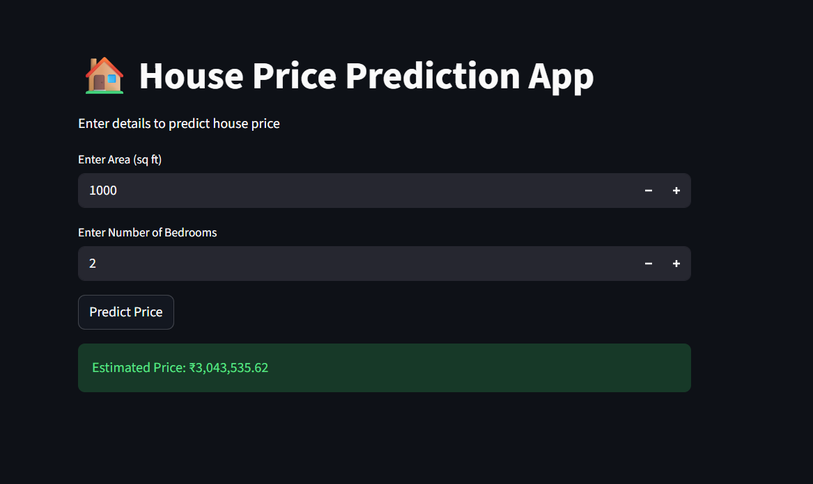
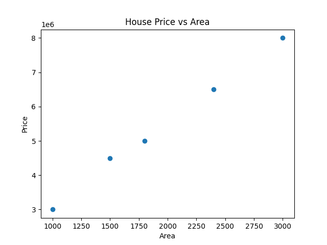

# 🏠 House Price Prediction Web App

## 📌 Problem Statement

Predict house prices based on area and number of bedrooms using Machine Learning.

---

## 🚀 Project Overview

This is an end-to-end Machine Learning project that uses **Linear Regression** to predict house prices.
The model is integrated into a **Streamlit web application** where users can input values and get real-time predictions.

---

## 🛠️ Tech Stack

* Python
* Pandas
* NumPy
* Matplotlib
* Scikit-learn
* Streamlit

---

## 📂 Project Structure

```
house-price-prediction/
│── app.py
│── house_price.py
│── data.csv
│── requirements.txt  
│── README.md
│── graph.png
│── app_screenshot.png
```

---

## ⚙️ How to Run

### 1. Install Dependencies

```
py -m pip install pandas numpy matplotlib scikit-learn streamlit
```

### 2. Run the App

```
py -m streamlit run app.py
```

---

## 🌐 Features

* Predict house price instantly
* Simple and interactive UI
* Real-time user input
* Data visualization

---

## 📸 Demo



---

## 📊 Visualization



---

## 📈 Output Example

Estimated Price: ₹11,33,333.33

---

## 🎯 Learning Outcomes

* Regression model implementation
* Data preprocessing
* Model training and prediction
* Building ML web apps using Streamlit

---

## 🔮 Future Improvements

* Add more features (location, bathrooms)
* Use larger dataset
* Deploy app online

---

