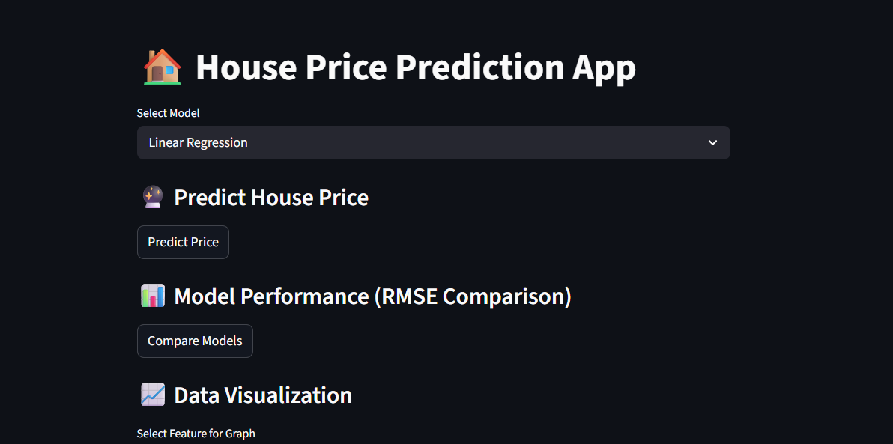
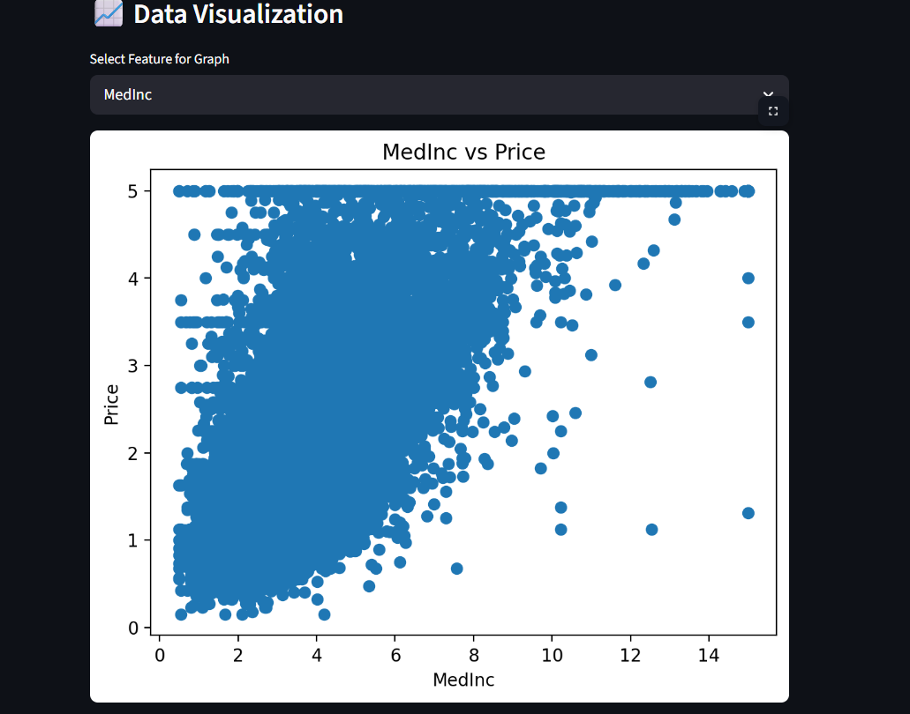
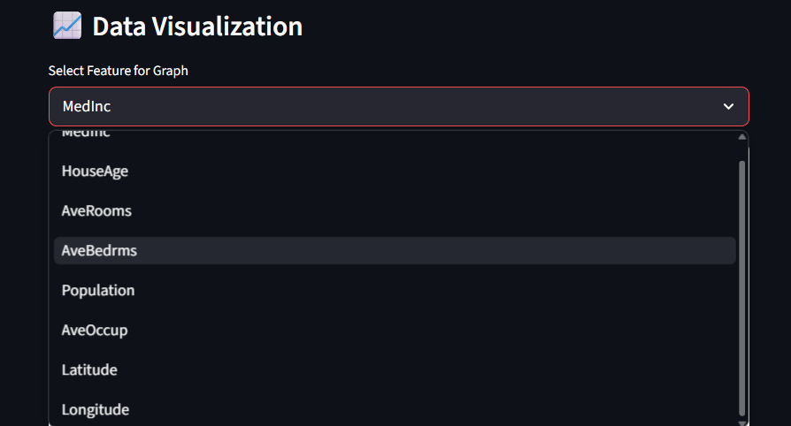

# 🏠 House Price Prediction with Model Comparison

An interactive Machine Learning web application that predicts house prices and compares model performance using Linear Regression and Random Forest.

---


## 🚀 Features

- 🔹 Predict house prices using input features
- 🔹 Compare multiple models:
  - Linear Regression
  - Random Forest
- 🔹 Evaluate models using:
  - RMSE (Root Mean Squared Error)
  - R² Score
- 🔹 Interactive web app using Streamlit
- 🔹 Data visualization (Area vs Price)
- 🔹 Model comparison table and graph
- 🔹 Best model selection

---

## 🧠 Models Used

### 1. Linear Regression
- Simple and fast
- Works well for linear relationships

### 2. Random Forest
- Handles complex and non-linear data
- Uses multiple decision trees

---
## 📊 Dataset

* Based on a multi-feature housing dataset (California Housing style)
* Contains features such as:

  * Median Income (MedInc)
  * House Age (HouseAge)
  * Average Rooms (AveRooms)
  * Average Bedrooms (AveBedrms)
  * Population
  * Average Occupancy (AveOccup)
  * Latitude & Longitude
* Target variable: **House Price**

---

## 📊 Evaluation Metrics

- **RMSE (Root Mean Squared Error)** → Lower is better  
- **R² Score** → Higher is better  

---

## 📸 Application Screenshots

### 🔹 Main Interface


### 🔹 Prediction Output


### 🔹 Model Comparison


### 🔹 Data Visualization (Area vs Price)



---

## 📂 Project Structure

```
house-price-prediction/
│
├── data/
│   └── data.csv
│
├── models/
│   ├── linear.pkl
│   └── rf.pkl
│
├── src/
│   ├── train_model.py
│   ├── predict.py
│   ├── evaluate.py
│   └── utils.py
│
├── assets/
│   ├── app_ui.png
│   ├── prediction.png
│   ├── comparison.png
│   └── features_vs_price.png and features.png
│
├── app.py
├── requirements.txt
└── README.md
```
---
## ⚙️ Setup & Run

### Install dependencies

```
pip install -r requirements.txt
```

### Train models

```
cd src
python train_model.py
```

### Run app

```
cd ..
streamlit run app.py
```

---

## 🎯 Results & Insights

- Model performance depends on the dataset
- Linear Regression performs better on linear data
- Random Forest performs better on complex/non-linear data
- RMSE is used as the primary metric for comparison
- Visualization helps in understanding both data and model performance

---


## 🔮 Future Improvements

* Add user input sliders for all features
* Hyperparameter tuning
* Feature importance visualization
* Deploy using cloud platforms
---


