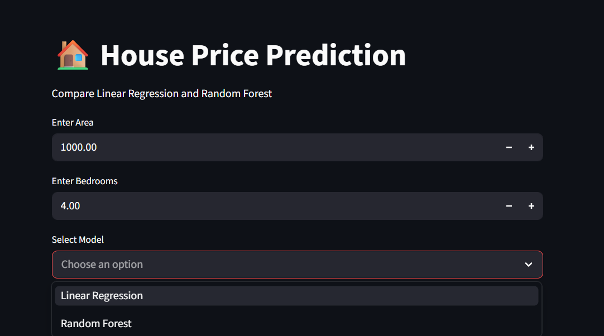
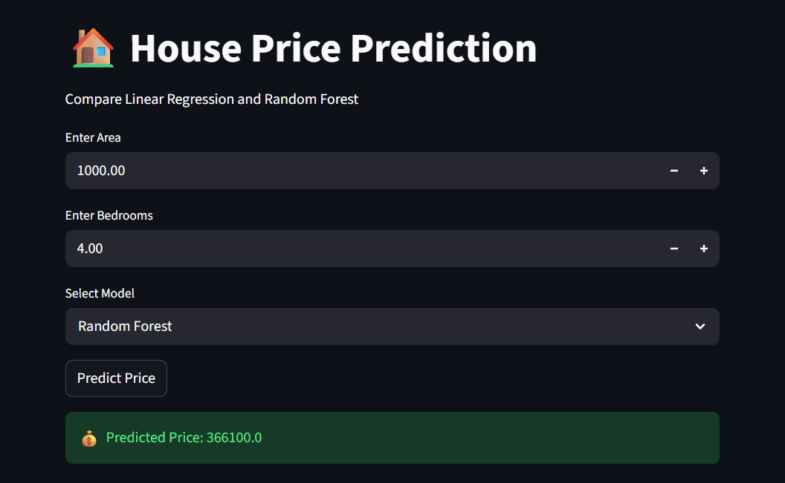
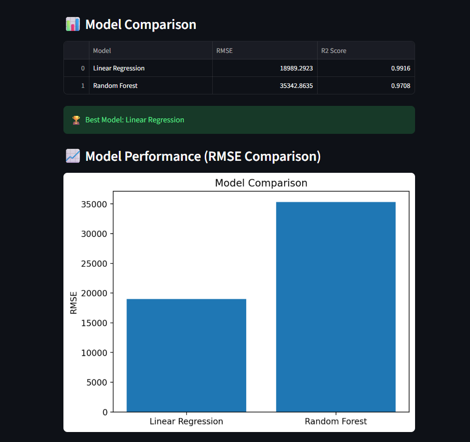
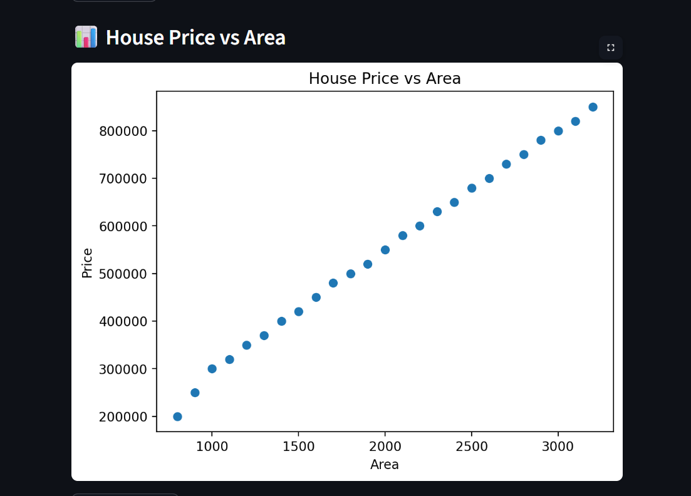

# 🏠 House Price Prediction with Model Comparison

## 📌 Overview
This project predicts house prices using Machine Learning models and compares their performance.

Initially, Linear Regression was used. Later, the project was upgraded by adding Random Forest and implementing a full comparison system with visualization.

---

## 🚀 Features

- 🔹 Predict house prices using input features
- 🔹 Compare multiple models:
  - Linear Regression
  - Random Forest
- 🔹 Evaluate models using:
  - RMSE (Root Mean Squared Error)
  - R² Score
- 🔹 Interactive web app using Streamlit
- 🔹 Data visualization (Area vs Price)
- 🔹 Model comparison table and graph
- 🔹 Best model selection

---

## 🧠 Models Used

### 1. Linear Regression
- Simple and fast
- Works well for linear relationships

### 2. Random Forest
- Handles complex and non-linear data
- Uses multiple decision trees

---

## 📊 Evaluation Metrics

- **RMSE (Root Mean Squared Error)** → Lower is better  
- **R² Score** → Higher is better  

---

## 📸 Application Screenshots

### 🔹 Main Interface

### 🔹 Prediction Output

### 🔹 Model Comparison

### 🔹 Data Visualization (Area vs Price)

---

## 📂 Project Structure
house-price-prediction/
│
├── data/
│ └── data.csv
│
├── models/
│ ├── linear.pkl
│ └── rf.pkl
│
├── src/
│ ├── train_model.py
│ ├── predict.py
│ ├── evaluate.py
│ └── utils.py
│
├── assets/
│ ├── ui.png
│ ├── prediction.png
│ ├── comparison.png
│ └── area_vs_price.png
│
├── app.py
├── requirements.txt
└── README.md

---

## ⚙️ How to Run the Project

### 1️⃣ Install Dependencies

---

### 2️⃣ Train Models

---

### 3️⃣ Run the Application

---

## 🎯 Results & Insights

- Model performance depends on the dataset
- Linear Regression performs better on linear data
- Random Forest performs better on complex/non-linear data
- RMSE is used as the primary metric for comparison
- Visualization helps in understanding both data and model performance

---

## 🔮 Future Improvements

- Add more features to dataset
- Use advanced models (XGBoost)
- Hyperparameter tuning
- Deploy application online (Streamlit Cloud / Render)

---

